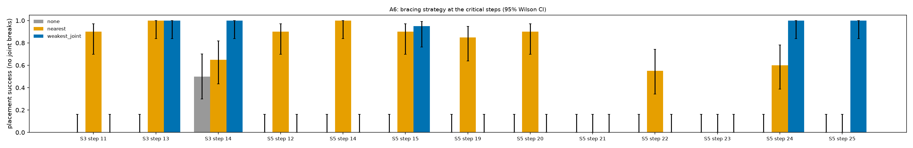
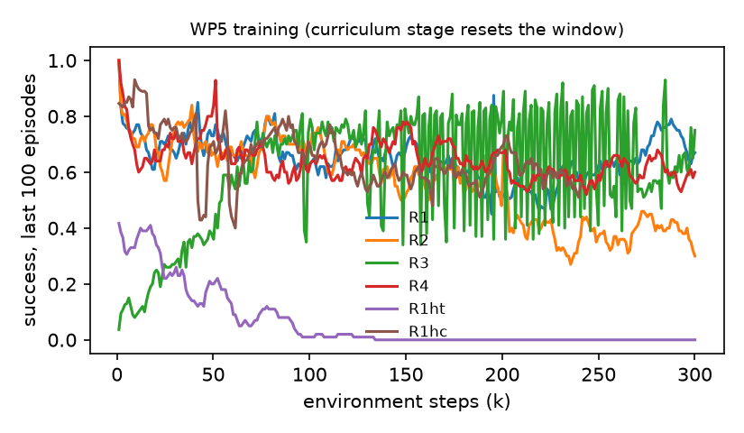

# Bracing Interlocking Brick Structures with a Second Arm: Necessary, but Not Where a Plastic Force Model Says
### Dual-arm robotic assembly of interlocking brick structures — v3.1 results

**Companion to** `Docs/master_report.md` v3.1 (plan, amendments §7.7) · **Data** `brickassembly/results/` · **Ledger** `brickassembly/ledger.jsonl`
**Date** 27 September 2026 · **Execution platform** CPU MuJoCo twin (master_report §0.6) · **Title** changed from the plan's under the G7 rule for a non-positive A6 (ledger `a6_verdict`) · **Updated** 28 September 2026: A6's S5 cells extended from 5 to 20 seeds (ledger `a6_s5_20seeds`)

Every table below is produced by `brickassembly/experiments/analyze.py` from the raw trial logs and rendered by `experiments/tables.py`, unedited; the test-suite numbers come from the JSON files the suites write. The narrative quotes those tables.

---

## 1. Summary

The plan's question was whether a second arm, bracing the structure where a force-balance model says it is weakest, lets a robot assemble interlocking-brick structures that one arm cannot. It was executed in a CPU MuJoCo twin of the cell (no GPU was available; amendments M1–M14 of the master report say what changed and why). Every gate was evaluated and every experiment the plan marks as required (A6, A3, A10) was run, along with A1, A4 and a dense-reward ablation; **three gates fail and the main hypothesis does not hold as stated.**

**What holds.**
* **A second arm is necessary.** Unbraced, the critical steps of the corbelled bridge (S3) succeed 10 times in 60 and those of the tower (S5) never (0/200); braced, 67–85 % and 30–57 %.
* **Where to brace matters.** At single steps the two bracing strategies differ by up to 100 points. Where the force model names the joint that actually fails, weakest-joint bracing beats the nearest-brick heuristic (S3 step 14: 100 % vs 65 %; S5 step 25: 100 % vs 0 %) and cuts the placer's peak force by 31 %, the effect size the literature reports.
* **Joint-model fidelity changes what an insertion policy learns (A10).** A policy trained on a light hand-tuned joint, with the force limits held equal, learns to press hard; on the calibrated joint it seats 23 % against 66 % (p = 1e-9). Derive the force limits from the light model as well, and training collapses entirely.
* **Force sensing was enough; vision was not needed (A3),** so the perception package (WP6) was skipped.

**What does not.**
* **A6, the main experiment, is negative for the proposed method.** Pooled, the naive heuristic beats weakest-joint bracing on both structures (S3 85 % vs 67 %, p = 0.04; S5 57 % vs 30 %, p = 3e-7). The rigid-plastic force model (StableLego's formulation) misplaces the failure in brittle, compliant joints: it braces a pier's base while its upper joints fail, and it rates four S5 steps safe unbraced that fail every time. That model — not the idea of bracing — is the bottleneck.
* **G3 fails:** the scripted pipeline completes S1 17/20, S2 5/20, S3 0/20 (targets 90 / 90 / 60 %); nearly every failure is a joint break during a later placement, not a failed insertion.
* **G4 fails:** no insertion policy reaches the 85 % stage-3 target (best 24 %), and the success head's AUC stays below 0.85. An end-to-end policy with a press channel beat the residual one (A4), against the plan's prior.
* **G6 fails:** with the RL policy inserting first, no planned full assembly completes (0/15), and the full system is worse than scripted-only on S1 (1/5 vs 17/20).

The failures are reported with their causes and the fixes that were tried. Four integration defects in the RL adapter were found and fixed (M14), one of which had silently disabled the policy. A regression in the scripted inserter's search was found late and is disclosed rather than patched (§9).

| gate | verdict |
|---|---|
| G0 platform | pass (twin) |
| G1 joint model | pass for the model; the slow insertion check fails at the final code |
| G2 planner | pass, except accessibility of S4/S5 |
| G3 scripted end-to-end | **fail** |
| G4 RL insertion | **fail** |
| G5 perception | not triggered (A3) |
| G6 full loop | **fail** |
| G7 analysis | pass, with G6 at one planned seed |

---

## 2. What was executed

The GPU stack of §2.4 (Isaac Sim / Isaac Lab, Newton, BrickSim, cuRobo) carried WP0–WP2 and the Newton prototype. WP3–WP8 were executed in a CPU MuJoCo 3.3.7 twin of the same cell, because the v3.1 execution environment had no GPU. The twin keeps what the contribution depends on and departs where the plan assumed GPU scale (amendments M1–M14):

| component | plan (v3.0) | executed (v3.1) |
|---|---|---|
| arms, control | 2 × FR3, Isaac Lab OSC | 2 × Menagerie Panda, the §2.5 impedance law (−ΛJ̇q̇, dynamically consistent null space), 500 Hz over 1 kHz physics |
| bricks | §2.3.1 hollow shells | same geometry; collision filtering per §2.3.2 by bitmasks |
| joint model | BrickSim | weld pool + stud-interference tendon + §2.3.3 gate; break by the plastic per-connection capacity (equal to BrickSim's LP to 1e-15), symmetry-aware |
| stability | StableLego force balance | global force-balance LP (`stability.py`) |
| bracing | Allegro, press-down | parallel-jaw **grasp**, coordinated feed-forward (M4) |
| accessibility | cuRobo swept volume | finger-clearance rule + IK reachability + twin hand-collision check |
| executor | py_trees | py_trees, §WP4's tree, §2.6 episode log per attempt |
| RL | Isaac Lab + rsl_rl, GPU | reduced insertion MDP on CPU + small PPO, 300 k samples per run (M8) |

---

## 3. Gates

| gate | criterion (master_report) | verdict | evidence |
|---|---|---|---|
| **G0** twin platform | stack runs; impedance control verified | **pass** (twin) | OSC circle tracking 0.036 / 0.15 / 0.42 mm RMS at 16 / 52 / 105 mm/s; `tests/test_control.py` 9/9 |
| **G1** joint model | §2.3.3 invariants, calibrated forces | **pass** for the joint model; the slow insertion check **fails** at the final code | `tests/test_clutch.py` 10/10 fast checks (wrench readback 7e-7, equal-and-opposite 1e-16, 30 s hold drift 3.5e-5 mm, release 45.3 N vs 45.2 N). Scripted insertion from ≤ 2 mm error: 9/10 at the first twin commit, **2/10** at the frozen code (a search regression, §9) |
| **G2** planner | drop test, accessibility, single-arm failure of S3/S5, valid plans for all strategies | **pass, except accessibility of S4/S5** | `tests/test_planner.py` 32 pass + 2 strict xfail (S4, S5: flanked 2x2 grasps); drop test max 0.096 mm. Slow twin check, final plans: unbraced, S3 step 13 breaks 4 joints and S5 step 25 breaks 29; weakest-joint braced, both place with none |
| **G3** scripted end-to-end | S1, S2 ≥ 90 %; S3 ≥ 60 % braced; test_control | **fail** | S1 85 %, S2 25 %, S3 0 % (§4); test_control passes |
| **G4** RL | ≥ 85 % at stage 3, peak ≤ 1.6× seating (M6); R1 vs R3; R4 recorded; predictor AUC > 0.85; test_env | **fail** (success, AUC); comparisons recorded | best stage-3 success 24 % (R4); AUC 0.41–0.78; `tests/test_env.py` 4/4 |
| **G5** perception | only if A3 shows vision is needed | **not triggered** — WP6 skipped | A3: removing the vision group did not hurt (§6) |
| **G6** full loop | S1–S5 × 3 strategies without intervention; brace wrench predicted vs measured | **fail** — 0/15 planned assemblies; the full system completes 1/15 on S1–S3 | §7 |
| **G7** analysis | mean ± 95 % CI over 20 seeds, paired tests, effect sizes | **pass with an exception** | this report, `results/analysis.json`; Wilson CIs, exact McNemar on matched seeds, Wilcoxon, Fisher. G6 has one planned seed (A6's S5 cells, at 5 seeds in the first version of this report, now have 20) |

A gate that fails here is reported, not re-scoped: §WP4 says a G3 failure stops forward work, and v3.1 ran the downstream work packages anyway only because the experiments that depend on G3 (A6's critical-step trials, WP5) were designed not to depend on a full assembly succeeding (M11).

---

## 4. G3 — the scripted pipeline

### G3 benchmark (scripted inserter, ground-truth poses, weakest-joint bracing)

| structure | complete | rate [95% CI] | mean fraction placed | attempts / brick | failure modes |
|---|---|---|---|---|---|
| S1 | 17/20 | 85% [64, 95] | 0.88 | 0.90 | joint_break: [('b_000', None)] |
| S2 | 5/20 | 25% [11, 47] | 0.70 | 0.76 | joint_break: [('b_004', 'b_001')]; joint_break: [('b_005', 'b_001')] |
| S3 | 0/20 | 0% [0, 16] | 0.41 | 0.51 | joint_break: [('b_000', None), ('b_002', 'b_000'), ('b_006',; joint_break: [('b_000', None)]; joint_break: [('b_001', None)] |

The behaviour tree, grasp, transport, scripted insertion and brace are exercised end to end, and every attempt is logged in the §2.6 `insertion_episode` format (`results/g3/episodes.jsonl`). What fails is reliability over a whole structure: a single joint break anywhere ends an assembly (M7), and the probability of one per placement is too high for 12- and 16-brick structures.

Failure modes, from the logs and the traced runs (ledger entries `v31_*`):

1. **Base-joint breaks of 2x2 columns** (S1's 3 failures; S3's early steps). A brick that arrives a few tenths of a millimetre off lands on one chamfer, loads the studs on one edge, and turns ~1° in the fingers during the press; when the joint engages, the weld corrects that tilt against the grasp and the support's base joint — 4 studs, a 16 mm lever — breaks. G6's traces place the break within ~20 ms after the joint reports seated, as the press is released (§7).
2. **Bridging bricks torn off by later insertions** (S2's 15 failures): the 2x4s that lap two supports with 4 studs each break when a neighbour or the brick above is pressed.
3. **The pier of S3** (9 of the 20 runs end here, at step 11; 10 others end at steps 2–4 by failure mode 1, one at step 9): the second corbel's 93 N press leans the four-high 2x2 pier ~2° before any joint yields, which the rigid-plastic force model does not represent (M13); braced or not, the pier breaks.

Three defects found on the way were fixed and are in the frozen code (commit 5a432ed): the joint model evaluated connections in the frame of a support mated 180° from nominal (a real bug — step trials never exercised it because pre-placed bricks are never flipped), a flanked-2x2 grasp that dragged its neighbour (fixed by sequencing), and a force-controlled press with no speed limit (the snap-through hit the seat at 40 mm/s).

---

## 5. A6 — does principled bracing help? (main experiment)

**Design (M11).** At every step that any strategy braces, the structure is pre-placed and mated up to that step, and the step is executed by the behaviour tree with each strategy on the same seeds (feeder position, handoff error, F/T noise). A placement succeeds if the brick seats and **no joint anywhere breaks**. The three strategies share one trigger (predicted utilisation × 3.0 ≥ 1) and one stabilizer controller, so they differ only in *where* the stabilizer grasps. n = 20 seeds per cell: 60 trials per strategy on S3 (three critical steps) and 200 on S5 (ten). S5's seeds 0–4 ran on the 4-core machine of the original execution (two hours for 150 trials) and seeds 5–19 on a 16-core workstation (18 minutes for 450), in the same pinned environment, which reproduces the first machine's trials exactly (ledger `local_gpu_twin`).

### A6 — placement success at the critical steps (no joint may break)

| structure / step | none | nearest | weakest_joint |
|---|---|---|---|
| S3/11 | 0/20 = 0% [0, 16] | 18/20 = 90% [70, 97] | 0/20 = 0% [0, 16] |
| S3/13 | 0/20 = 0% [0, 16] | 20/20 = 100% [84, 100] | 20/20 = 100% [84, 100] |
| S3/14 | 10/20 = 50% [30, 70] | 13/20 = 65% [43, 82] | 20/20 = 100% [84, 100] |
| S5/12 | 0/20 = 0% [0, 16] | 18/20 = 90% [70, 97] | 0/20 = 0% [0, 16] |
| S5/14 | 0/20 = 0% [0, 16] | 20/20 = 100% [84, 100] | 0/20 = 0% [0, 16] |
| S5/15 | 0/20 = 0% [0, 16] | 18/20 = 90% [70, 97] | 19/20 = 95% [76, 99] |
| S5/19 | 0/20 = 0% [0, 16] | 17/20 = 85% [64, 95] | 0/20 = 0% [0, 16] |
| S5/20 | 0/20 = 0% [0, 16] | 18/20 = 90% [70, 97] | 0/20 = 0% [0, 16] |
| S5/21 | 0/20 = 0% [0, 16] | 0/20 = 0% [0, 16] | 0/20 = 0% [0, 16] |
| S5/22 | 0/20 = 0% [0, 16] | 11/20 = 55% [34, 74] | 0/20 = 0% [0, 16] |
| S5/23 | 0/20 = 0% [0, 16] | 0/20 = 0% [0, 16] | 0/20 = 0% [0, 16] |
| S5/24 | 0/20 = 0% [0, 16] | 12/20 = 60% [39, 78] | 20/20 = 100% [84, 100] |
| S5/25 | 0/20 = 0% [0, 16] | 0/20 = 0% [0, 16] | 20/20 = 100% [84, 100] |
| S3/pooled | 10/60 = 17% [9, 28] | 51/60 = 85% [74, 92] | 40/60 = 67% [54, 77] |
| S5/pooled | 0/200 = 0% [0, 2] | 114/200 = 57% [50, 64] | 59/200 = 30% [24, 36] |

Paired comparisons on matched seeds (exact McNemar; difference in success rate, b − a, with 95% CI). Comparisons with fewer than 10 pairs are in `results/analysis.json` only:

| comparison | pairs | only b succeeds | only a succeeds | difference [95% CI] | p |
|---|---|---|---|---|---|
| S3/11 none->weakest_joint | 20 | 0 | 0 | +0.00 [+0.00, +0.00] | 1 |
| S3/11 nearest->weakest_joint | 20 | 0 | 18 | -0.90 [-1.03, -0.77] | 7.63e-06 |
| S3/11 none->nearest | 20 | 18 | 0 | +0.90 [+0.77, +1.03] | 7.63e-06 |
| S3/13 none->weakest_joint | 20 | 20 | 0 | +1.00 [+1.00, +1.00] | 1.91e-06 |
| S3/13 nearest->weakest_joint | 20 | 0 | 0 | +0.00 [+0.00, +0.00] | 1 |
| S3/13 none->nearest | 20 | 20 | 0 | +1.00 [+1.00, +1.00] | 1.91e-06 |
| S3/14 none->weakest_joint | 20 | 10 | 0 | +0.50 [+0.28, +0.72] | 0.00195 |
| S3/14 nearest->weakest_joint | 20 | 7 | 0 | +0.35 [+0.14, +0.56] | 0.0156 |
| S3/14 none->nearest | 20 | 5 | 2 | +0.15 [-0.11, +0.41] | 0.453 |
| S5/12 none->weakest_joint | 20 | 0 | 0 | +0.00 [+0.00, +0.00] | 1 |
| S5/12 nearest->weakest_joint | 20 | 0 | 18 | -0.90 [-1.03, -0.77] | 7.63e-06 |
| S5/12 none->nearest | 20 | 18 | 0 | +0.90 [+0.77, +1.03] | 7.63e-06 |
| S5/14 none->weakest_joint | 20 | 0 | 0 | +0.00 [+0.00, +0.00] | 1 |
| S5/14 nearest->weakest_joint | 20 | 0 | 20 | -1.00 [-1.00, -1.00] | 1.91e-06 |
| S5/14 none->nearest | 20 | 20 | 0 | +1.00 [+1.00, +1.00] | 1.91e-06 |
| S5/15 none->weakest_joint | 20 | 19 | 0 | +0.95 [+0.85, +1.05] | 3.81e-06 |
| S5/15 nearest->weakest_joint | 20 | 2 | 1 | +0.05 [-0.12, +0.22] | 1 |
| S5/15 none->nearest | 20 | 18 | 0 | +0.90 [+0.77, +1.03] | 7.63e-06 |
| S5/19 none->weakest_joint | 20 | 0 | 0 | +0.00 [+0.00, +0.00] | 1 |
| S5/19 nearest->weakest_joint | 20 | 0 | 17 | -0.85 [-1.01, -0.69] | 1.53e-05 |
| S5/19 none->nearest | 20 | 17 | 0 | +0.85 [+0.69, +1.01] | 1.53e-05 |
| S5/20 none->weakest_joint | 20 | 0 | 0 | +0.00 [+0.00, +0.00] | 1 |
| S5/20 nearest->weakest_joint | 20 | 0 | 18 | -0.90 [-1.03, -0.77] | 7.63e-06 |
| S5/20 none->nearest | 20 | 18 | 0 | +0.90 [+0.77, +1.03] | 7.63e-06 |
| S5/21 none->weakest_joint | 20 | 0 | 0 | +0.00 [+0.00, +0.00] | 1 |
| S5/21 nearest->weakest_joint | 20 | 0 | 0 | +0.00 [+0.00, +0.00] | 1 |
| S5/21 none->nearest | 20 | 0 | 0 | +0.00 [+0.00, +0.00] | 1 |
| S5/22 none->weakest_joint | 20 | 0 | 0 | +0.00 [+0.00, +0.00] | 1 |
| S5/22 nearest->weakest_joint | 20 | 0 | 11 | -0.55 [-0.77, -0.33] | 0.000977 |
| S5/22 none->nearest | 20 | 11 | 0 | +0.55 [+0.33, +0.77] | 0.000977 |
| S5/23 none->weakest_joint | 20 | 0 | 0 | +0.00 [+0.00, +0.00] | 1 |
| S5/23 nearest->weakest_joint | 20 | 0 | 0 | +0.00 [+0.00, +0.00] | 1 |
| S5/23 none->nearest | 20 | 0 | 0 | +0.00 [+0.00, +0.00] | 1 |
| S5/24 none->weakest_joint | 20 | 20 | 0 | +1.00 [+1.00, +1.00] | 1.91e-06 |
| S5/24 nearest->weakest_joint | 20 | 8 | 0 | +0.40 [+0.18, +0.62] | 0.00781 |
| S5/24 none->nearest | 20 | 12 | 0 | +0.60 [+0.38, +0.82] | 0.000488 |
| S5/25 none->weakest_joint | 20 | 20 | 0 | +1.00 [+1.00, +1.00] | 1.91e-06 |
| S5/25 nearest->weakest_joint | 20 | 20 | 0 | +1.00 [+1.00, +1.00] | 1.91e-06 |
| S5/25 none->nearest | 20 | 0 | 0 | +0.00 [+0.00, +0.00] | 1 |
| S3/pooled none->weakest_joint | 60 | 30 | 0 | +0.50 [+0.37, +0.63] | 1.86e-09 |
| S3/pooled nearest->weakest_joint | 60 | 7 | 18 | -0.18 [-0.34, -0.03] | 0.0433 |
| S5/pooled none->weakest_joint | 200 | 59 | 0 | +0.29 [+0.23, +0.36] | 3.47e-18 |
| S5/pooled nearest->weakest_joint | 200 | 30 | 85 | -0.28 [-0.37, -0.18] | 2.86e-07 |

Placer peak force (matched seeds, Wilcoxon; cells with at least 10 pairs):

| comparison | n | mean a (N) | mean b (N) | change | p |
|---|---|---|---|---|---|
| S3/11 none->weakest_joint | 20 | 77.5 | 93.3 | +20.5% | 0.00422 |
| S3/11 nearest->weakest_joint | 20 | 71.4 | 93.3 | +30.6% | 1.91e-06 |
| S3/11 none->nearest | 20 | 77.5 | 71.4 | -7.8% | 1.91e-06 |
| S3/13 none->weakest_joint | 20 | 98.7 | 41.4 | -58.0% | 4.77e-05 |
| S3/13 nearest->weakest_joint | 20 | 60.2 | 41.4 | -31.2% | 5.72e-06 |
| S3/13 none->nearest | 20 | 98.7 | 60.2 | -39.0% | 0.00831 |
| S3/14 none->weakest_joint | 20 | 73.9 | 76.9 | +4.1% | 0.0362 |
| S3/14 nearest->weakest_joint | 20 | 72.2 | 76.9 | +6.5% | 0.00831 |
| S3/14 none->nearest | 20 | 73.9 | 72.2 | -2.2% | 0.0484 |
| S5/12 none->weakest_joint | 20 | 110.1 | 174.2 | +58.2% | 0.0107 |
| S5/12 nearest->weakest_joint | 20 | 55.1 | 174.2 | +216.3% | 8.84e-05 |
| S5/12 none->nearest | 20 | 110.1 | 55.1 | -50.0% | 1.91e-06 |
| S5/14 none->weakest_joint | 20 | 106.2 | 96.8 | -8.9% | 5.72e-06 |
| S5/14 nearest->weakest_joint | 20 | 81.7 | 96.8 | +18.4% | 1.91e-06 |
| S5/14 none->nearest | 20 | 106.2 | 81.7 | -23.0% | 1.91e-06 |
| S5/15 none->weakest_joint | 20 | 59.6 | 42.3 | -29.1% | 1.91e-06 |
| S5/15 nearest->weakest_joint | 20 | 42.1 | 42.3 | +0.5% | 0.0438 |
| S5/15 none->nearest | 20 | 59.6 | 42.1 | -29.4% | 1.91e-06 |
| S5/19 none->weakest_joint | 20 | 55.6 | 46.7 | -16.0% | 1.91e-06 |
| S5/19 nearest->weakest_joint | 20 | 47.5 | 46.7 | -1.6% | 0.00102 |
| S5/19 none->nearest | 20 | 55.6 | 47.5 | -14.6% | 1.91e-06 |
| S5/20 none->weakest_joint | 20 | 65.4 | 55.9 | -14.5% | 1.91e-05 |
| S5/20 nearest->weakest_joint | 20 | 45.7 | 55.9 | +22.4% | 8.84e-05 |
| S5/20 none->nearest | 20 | 65.4 | 45.7 | -30.1% | 1.91e-06 |
| S5/21 none->weakest_joint | 20 | 60.2 | 43.9 | -27.1% | 1.91e-06 |
| S5/21 nearest->weakest_joint | 20 | 45.5 | 43.9 | -3.5% | 0.154 |
| S5/21 none->nearest | 20 | 60.2 | 45.5 | -24.4% | 1.91e-06 |
| S5/22 none->weakest_joint | 20 | 53.2 | 42.3 | -20.6% | 1.91e-06 |
| S5/22 nearest->weakest_joint | 20 | 41.3 | 42.3 | +2.3% | 0.546 |
| S5/22 none->nearest | 20 | 53.2 | 41.3 | -22.4% | 3.81e-06 |
| S5/23 none->weakest_joint | 20 | 61.3 | 47.4 | -22.6% | 1.91e-06 |
| S5/23 nearest->weakest_joint | 20 | 48.6 | 47.4 | -2.5% | 0.00068 |
| S5/23 none->nearest | 20 | 61.3 | 48.6 | -20.7% | 3.81e-06 |
| S5/24 none->weakest_joint | 20 | 100.4 | 96.1 | -4.3% | 0.0073 |
| S5/24 nearest->weakest_joint | 20 | 83.4 | 96.1 | +15.2% | 1.91e-06 |
| S5/24 none->nearest | 20 | 100.4 | 83.4 | -16.9% | 3.81e-06 |
| S5/25 none->weakest_joint | 20 | 253.6 | 97.0 | -61.7% | 0.00944 |
| S5/25 nearest->weakest_joint | 20 | 58.1 | 97.0 | +67.0% | 1.91e-06 |
| S5/25 none->nearest | 20 | 253.6 | 58.1 | -77.1% | 0.000463 |

Brace force, predicted (`expected_reaction_wrench`) vs measured at the placer's peak (forces only):

| strategy | placements | predicted mean (N) | measured mean (N) | |error| mean (N) | median (N) |
|---|---|---|---|---|---|
| nearest | 254 | 34.0 | 28.3 | 18.1 | 13.7 |
| weakest_joint | 259 | 36.6 | 37.0 | 16.0 | 12.5 |

**Reading.**

* **A second arm is necessary.** Unbraced, S3's critical steps succeed 10 times in 60 (all at the crown, step 14) and S5's never (0/200). Weakest-joint bracing against none, pooled: +50 points on S3 (paired McNemar p = 2e-9) and +29.5 on S5 (p = 3e-18). The premise of the project is measured, not assumed.
* **Where the stabilizer grasps matters a great deal** — single steps differ by up to 100 points between the two bracing strategies — **and the plastic force model chooses well at some steps and badly at others.**
  * Weakest-joint wins where the model names the joint that actually fails: S3's crown (step 14: 100 % vs 65 %, p = 0.016) and S5's last two steps (24: 100 % vs 60 %, p = 0.008; 25, the step the model rates worst at 2.52: 100 % vs 0 %, p = 2e-6). At S3 step 13 both succeed, but weakest-joint's brace carries the load where it should: **the placer's peak force falls 31 % against nearest and 58 % against no brace** (Wilcoxon p = 6e-6, 5e-5), the size of §4.4's benchmark ([DualArmSnapFit], 30 %).
  * It loses where the model names the wrong joint: S3 step 11 (0 % vs 90 %, p = 8e-6) — the model braces the pier's base, and the pier's upper joints fail — and five of S5's ten steps (12, 14, 19, 20, 22), where nearest succeeds 55–100 % and weakest-joint 0 % (each p ≤ 0.001). Of S5's other three, step 15 is a tie (nearest 90 %, weakest-joint 95 %) and no strategy places steps 21 or 23.
* **Pooled, the naive heuristic is better on both structures**: nearest 85 % vs weakest-joint 67 % on S3 (p = 0.04), 57 % vs 30 % on S5 (p = 3e-7). **A6 is negative for the proposed method.** It is not §4.4's null (placement clearly matters); it says that a lower-bound plastic force model is not a good enough guide to *where* (ledger `a6_verdict`).
* **Why the model is wrong.** StableLego's formulation (and ours) is a lower-bound plastic analysis of a rigid structure: joints are assumed to redistribute load until the best static distribution is reached. LEGO joints are brittle and the welded columns compliant — S3's pier leans ~2° under the corbel press — so load follows stiffness, not the optimum, and the first joint to break is often not the one the LP loads most. The model is also unconservative: on S5, the four critical steps it rates *below* 1 unbraced (0.71–0.93, braced only because of the safety factor) fail unbraced in all 80 trials, as S3's step 11 does at a rating of 0.40 (M13). An elastic analysis, or choosing the brace by simulating the candidates in the twin, is the change these results point to; neither was run.
* **Brace prediction.** The brace force the plan predicts (`expected_reaction_wrench`) and the force the stabilizer measures at the placer's peak agree on average (predicted 34 N / 37 N, measured 28 N / 37 N for nearest / weakest-joint, over 254 / 259 braced placements on S3 and S5), but not placement by placement: the mean absolute error is 16–18 N (median 12.5–13.7 N). Forces only; the measured torque is about the wrist, not the brace point.



---

## 6. WP5 — RL insertion, A1 / A3 / A4 / A-dense / A10

The insertion MDP is the reduced cell of M8 (floating 1.5 kg hand under the §2.5 impedance, same bricks and joint model, 7-D action with a press channel). Each run is 300 k environment steps of PPO with the §5.4 curriculum; every policy is then evaluated on 100 held-out episodes per stage on the **calibrated** joint (A10's three policies also at stage 0 on the hand-tuned joint).

### WP5 — policies on held-out episodes (100 each; the calibrated joint unless stated)

| policy | evaluated on | stage | success | peak force mean (N) | peak / seating force | success-head AUC | outcomes |
|---|---|---|---|---|---|---|---|
| scripted | calibrated | 0 | 52% ± 10 | 123.7 | 1.74 | — | force_violation 21, success 52, timeout 27 |
| scripted | calibrated | 3 | 56% ± 10 | 94.8 | 1.40 | — | force_violation 15, joint_break 13, success 56, timeout 16 |
| R1 | calibrated | 0 | 66% ± 9 | 85.5 | 1.20 | 0.72 | force_violation 2, success 66, timeout 32 |
| R1 | calibrated | 3 | 19% ± 8 | 55.1 | 0.80 | 0.63 | force_violation 5, joint_break 17, success 19, timeout 59 |
| R2 | calibrated | 0 | 38% ± 10 | 92.3 | 1.30 | 0.68 | force_violation 17, success 38, timeout 45 |
| R2 | calibrated | 3 | 8% ± 5 | 80.1 | 1.09 | 0.48 | force_violation 13, joint_break 6, success 8, timeout 73 |
| R3 | calibrated | 0 | 99% ± 2 | 98.1 | 1.38 | — | force_violation 1, success 99 |
| R3 | calibrated | 3 | 19% ± 8 | 78.8 | 1.19 | 0.69 | force_violation 14, joint_break 31, success 19, timeout 36 |
| R4 | calibrated | 0 | 81% ± 8 | 95.1 | 1.34 | 0.78 | force_violation 9, success 81, timeout 10 |
| R4 | calibrated | 3 | 24% ± 8 | 49.6 | 0.71 | 0.41 | force_violation 1, joint_break 34, success 24, timeout 41 |
| R1ht | calibrated | 0 | 11% ± 6 | 28.5 | 0.40 | 0.50 | force_violation 10, success 11, timeout 79 |
| R1ht | calibrated | 3 | 12% ± 6 | 46.3 | 0.49 | 0.75 | force_violation 9, joint_break 5, success 12, timeout 74 |
| R1hc | calibrated | 0 | 23% ± 8 | 110.8 | 1.56 | 0.45 | force_violation 35, success 23, timeout 42 |
| R1hc | calibrated | 3 | 18% ± 8 | 73.6 | 1.04 | 0.73 | force_violation 10, joint_break 34, success 18, timeout 38 |
| R1 | handtuned | 0 | 30% ± 9 | 39.4 | 0.55 | 0.68 | force_violation 48, success 30, timeout 22 |
| R1ht | handtuned | 0 | 0% ± 0 | 0.0 | 0.00 | — | timeout 100 |
| R1hc | handtuned | 0 | 61% ± 10 | 85.1 | 1.20 | 0.50 | force_violation 12, success 61, timeout 27 |

| ablation | a | b | success a → b | p (Fisher) | peak force a → b (N) |
|---|---|---|---|---|---|
| A1 scripted->R1 @stage0 | scripted | R1 | 52% → 66% | 0.0613 | 124 → 86 |
| A4 R3(e2e)->R2(residual) @stage0 | R3 | R2 | 99% → 38% | 1.44e-23 | 98 → 92 |
| A-dense R1(sparse)->R2(dense) @stage0 | R1 | R2 | 66% → 38% | 0.000121 | 86 → 92 |
| A3 R1(vision)->R4(no vision) @stage0 | R1 | R4 | 66% → 81% | 0.0244 | 86 → 95 |
| A10 R1(calibrated)->R1ht(hand-tuned) @stage0 | R1 | R1ht | 66% → 11% | 3.92e-16 | 86 → 29 |
| A10 R1(calibrated)->R1hc(hand-tuned, calibrated budget) @stage0 | R1 | R1hc | 66% → 23% | 1.25e-09 | 86 → 111 |
| A1 scripted->R1 @stage3 | scripted | R1 | 56% → 19% | 9.38e-08 | 95 → 55 |
| A4 R3(e2e)->R2(residual) @stage3 | R3 | R2 | 19% → 8% | 0.037 | 79 → 80 |
| A-dense R1(sparse)->R2(dense) @stage3 | R1 | R2 | 19% → 8% | 0.037 | 55 → 80 |
| A3 R1(vision)->R4(no vision) @stage3 | R1 | R4 | 19% → 24% | 0.491 | 55 → 50 |
| A10 R1(calibrated)->R1ht(hand-tuned) @stage3 | R1 | R1ht | 19% → 12% | 0.241 | 55 → 46 |
| A10 R1(calibrated)->R1hc(hand-tuned, calibrated budget) @stage3 | R1 | R1hc | 19% → 18% | 1 | 55 → 74 |

**Reading.**

* **No run on the calibrated joint reached curriculum stage 3 in training** (R1 reached stage 2; R2–R4 stage 1; only R1hc, on the lenient hand-tuned joint, spent 10 of 293 updates there before falling back), so stage-3 numbers measure out-of-distribution transfer, and the stage-0 comparisons are the in-distribution ones. **G4 is not met.**
* **A1 (RL vs scripted).** In distribution, the residual policy R1 raises success from 52 % to 66 % (p = 0.06) and lowers the peak force 31 % (124 → 86 N) — RL earns its place on force, less clearly on success. Out of distribution (stage 3) it is worse than the scripted spiral (19 % vs 56 %).
* **A4 (residual vs end-to-end).** Against §5.3's expectation ([Marougkas]), the end-to-end policy R3 is the best policy in this study: 99 % at stage 0 against 38 % for the residual R2 with the same dense reward. A plausible reason, specific to this task: the residual inherits the scripted base's slow, force-heavy search and has to learn to *undo* it within 300 k steps; with a press channel, an end-to-end policy can learn a fast press-and-wiggle directly.
* **A-dense (sparse vs dense, residual).** Dense shaping hurt the residual (66 % → 38 %).
* **A3 (the vision decision).** Removing the vision group did not hurt: R4 (no vision) 81 % vs R1 66 % in distribution (p = 0.02, in R4's favour), 24 % vs 19 % at stage 3 (p = 0.49). Per §4.4, A3 null → **WP6 is skipped** (ledger `vision_decision`). Caveat: the "vision" group here is a pose estimate with σ 0.3 mm against a 0.8 mm belief, not a learned camera embedding, so this says that a better *pose* estimate does not help the F/T-driven policy — it does not test pixels.
* **A10 (joint-model fidelity) — positive in distribution, in two ways.** The plan's comparison is R1 (trained on the calibrated joint) against the same run trained on a light, lenient hand-tuned joint (3 N insertion / 5 N break per stud, 2 mm gate), both evaluated on the calibrated joint. It was run twice, because the first version confounds two things (ledger `v31_a10_budget_confound`, §7.7 M10):
  * **R1ht — budget and base press scaled by the hand-tuned model's own insertion force**, as a builder who trusted that model would set them. Training collapsed: success on its own joint fell from 42 % to 0 %, and the final policy never touches the brick (100/100 timeouts at 0 N on the hand-tuned joint). With 3 N per stud a 2x4's budget is 37–48 N, below the touchdown transient, so the sparse −1 for a force violation made not pressing the optimum. On the calibrated joint it seats 11 % (vs R1's 66 %, p = 4e-16). A cheap joint model can make the task *untrainable* through the force limits derived from it.
  * **R1hc — budget and base press held at the calibrated seating force**, so that only the joint's mechanics differ. It trains normally and seats 61 % on its own joint, but **23 % on the calibrated joint** (vs 66 %, p = 1e-9), with **35 force violations in 100 episodes against R1's 2** and a mean peak of 111 N against 86 N. On a joint that seats at 3 N per stud, pressing hard costs nothing, and that is what it learned; on the real interference the same press overshoots the budget. This is the effect contribution (3) asks about: **a different learned force profile, from the joint model alone.**
  * Out of distribution (stage 3) the three policies are indistinguishable (19 %, 12 %, 18 %; p ≥ 0.24): there, all of them are limited by the curriculum they never finished, not by the joint they trained on.
* **Success predictor (§5.6).** On the reduced cell's held-out episodes the head's AUC is 0.41–0.78 (calibrated joint), below the 0.85 the gate asks for. In the full cell (G6, §7) R1's head ranks 109 attempts with AUC 0.88, but its probabilities are far too low (mean 0.20 against 54 % seated). It is logged in every episode as `predicted_success_prob` and was not used to verify placements.



---

## 7. G6 — the full loop

**Design.** §WP7's loop: the behaviour tree with the WP5 policy R1 as the nominal inserter and the scripted inserter as the fallback (RL-first, §WP7.1), on every structure with every strategy, one seed each (the planned 15 assemblies). S1, S2 and S4 trigger no brace, so their three strategies are the same deterministic run; to get enough placements to say anything about the inserter, seeds 1–4 of the full system (weakest-joint bracing) were added on S1–S3 (ledger `v31_g6_extra_seeds`).

### G6 — full loop, RL-first inserter with scripted fallback

| run | complete | placed | attempts | ended | joints broken |
|---|---|---|---|---|---|
| S1/nearest/seed0 | no | 0/6 | 2 | after a scripted_spiral_v1 seat | [('b_000', None), ('b_000', None)] |
| S1/none/seed0 | no | 0/6 | 2 | after a scripted_spiral_v1 seat | [('b_000', None), ('b_000', None)] |
| S1/weakest_joint/seed0 | no | 0/6 | 2 | after a scripted_spiral_v1 seat | [('b_000', None), ('b_000', None)] |
| S2/nearest/seed0 | no | 7/12 | 9 | during R1 insertion | [('b_004', 'b_001')] |
| S2/none/seed0 | no | 7/12 | 9 | during R1 insertion | [('b_004', 'b_001')] |
| S2/weakest_joint/seed0 | no | 7/12 | 9 | during R1 insertion | [('b_004', 'b_001')] |
| S3/nearest/seed0 | no | 2/16 | 5 | during scripted_spiral_v1 insertion | [('b_000', None)] |
| S3/none/seed0 | no | 2/16 | 5 | during scripted_spiral_v1 insertion | [('b_000', None)] |
| S3/weakest_joint/seed0 | no | 2/16 | 5 | during scripted_spiral_v1 insertion | [('b_000', None)] |
| S4/nearest/seed0 | no | 0/19 | 2 | after a scripted_spiral_v1 seat | [('b_003', None), ('b_003', None)] |
| S4/none/seed0 | no | 0/19 | 2 | after a scripted_spiral_v1 seat | [('b_003', None), ('b_003', None)] |
| S4/weakest_joint/seed0 | no | 0/19 | 2 | after a scripted_spiral_v1 seat | [('b_003', None), ('b_003', None)] |
| S5/nearest/seed0 | no | 5/26 | 10 | during R1 insertion | [('b_003', 'b_001')] |
| S5/none/seed0 | no | 5/26 | 10 | during R1 insertion | [('b_003', 'b_001')] |
| S5/weakest_joint/seed0 | no | 5/26 | 10 | during R1 insertion | [('b_003', 'b_001')] |
| S1/weakest_joint/seed1 (extra) | no | 1/6 | 3 | after a R1 seat | [('b_000', None)] |
| S1/weakest_joint/seed2 (extra) | no | 1/6 | 2 | after a R1 seat | [('b_000', None)] |
| S1/weakest_joint/seed3 (extra) | no | 1/6 | 3 | after a R1 seat | [('b_000', None)] |
| S1/weakest_joint/seed4 (extra) | yes | 6/6 | 10 | — | — |
| S2/weakest_joint/seed1 (extra) | no | 8/12 | 13 | during R1 insertion | [('b_004', 'b_001')] |
| S2/weakest_joint/seed2 (extra) | no | 7/12 | 12 | after a R1 seat | [('b_004', 'b_001'), ('b_004', 'b_000')] |
| S2/weakest_joint/seed3 (extra) | no | 7/12 | 9 | during R1 insertion | [('b_004', 'b_001')] |
| S2/weakest_joint/seed4 (extra) | no | 7/12 | 9 | after a R1 seat | [('b_004', 'b_001')] |
| S3/weakest_joint/seed1 (extra) | no | 2/16 | 6 | during scripted_spiral_v1 insertion | [('b_000', None)] |
| S3/weakest_joint/seed2 (extra) | no | 2/16 | 6 | during scripted_spiral_v1 insertion | [('b_000', None)] |
| S3/weakest_joint/seed3 (extra) | no | 2/16 | 4 | after a R1 seat | [('b_000', None)] |
| S3/weakest_joint/seed4 (extra) | no | 0/16 | 2 | after a scripted_spiral_v1 seat | [('b_000', None), ('b_000', None)] |

| inserter | attempts | seated [95% CI] | breaks during its insertions | peak force mean (N) | success head: mean p, AUC |
|---|---|---|---|---|---|
| R1 | 112 | 61 = 54% [45, 63] | 8 | 90.0 | 0.20, 0.88 (n = 109) |
| scripted_spiral_v1 | 51 | 51 = 100% [93, 100] | 5 | 59.4 | — |

Full system (weakest-joint bracing) with the RL-first inserter vs G3's scripted-only pipeline:

| structure | G6 complete | G3 complete | p (Fisher) | mean fraction placed, G6 → G3 |
|---|---|---|---|---|
| S1 | 1/5 | 17/20 | 0.0123 | 0.30 → 0.88 |
| S2 | 0/5 | 5/20 | 0.544 | 0.60 → 0.70 |
| S3 | 0/5 | 0/20 | 1 | 0.10 → 0.41 |

How the failed runs ended: during R1 insertion 8; after a scripted_spiral_v1 seat 7; after a R1 seat 6; during scripted_spiral_v1 insertion 5.

**Reading.**

* **G6 fails: no planned assembly completes (0/15).** On S3 and S5 every run ends before the first braced step (S3 at 2/16, S5 at 5/26), so G6 never exercised the stabilizer, and "brace wrench predicted vs measured" is answered by A6 (§5), not here.
* **RL-first is worse than scripted-only.** The full system completes S1 once in five seeds, against 17/20 for G3's scripted pipeline (p = 0.01), and places a smaller fraction of every structure. No run ends because a brick would not *seat*: the policy seats 54 % of its attempts and the fallback seats every brick handed to it. What ends each run is a **joint break** — during an RL insertion, during a fallback insertion after a failed RL attempt, or within ~20 ms after a brick seats. The policy presses harder than the scripted inserter (mean peak 90 N vs 59 N) and makes more attempts per brick, and every attempt on a 2x2 column is another chance at the base break G3 already shows (§4, failure mode 1).
* **Why a break right after seating?** In S1 and S4 the base of a 2x2 column breaks within ~20 ms after the joint reports seated, when the press is released. Holding the press 0.1 s and ramping it out (a probe on two S1 seeds, not committed) completed one of them; that is an open hypothesis, not a finding (ledger `v31_release_ramp`).
* **The success head works in the cell once the observation is right.** On 109 RL attempts in the full cell it ranks outcomes with AUC 0.88 — better than on the reduced cell's held-out episodes — but its probabilities are far too low (mean 0.20 against 54 % seated). It is logged in every episode (`predicted_success_prob`), not used to verify.
* **Four integration defects were found and fixed on the way** (§7.7 M14; ledger `v31_rl_inserter_frame`, `v31_rl_fallback_half_seated`, `v31_rl_press_stop`): world-frame observations of a hand at the plan's yaw (the head read 0.002 on every attempt), the policy's orientation target left in place on exit, a half-seated brick the fallback never reached, and a press that ran on for up to 50 ms after a snap-through. The first two G6 runs were discarded; the numbers above are from the final adapter only.

---

## 8. Findings, in one place

1. Bracing is necessary: without a stabilizer the critical steps succeed 17 % of the time on the corbelled bridge (S3) and never on the tower (S5); with one, 67–85 % and 30–57 %.
2. Where the static force model identifies the failing joint correctly, principled (weakest-joint) bracing beats the naive nearest-brick heuristic in success (S3 step 14, +35 points; S5 steps 24–25) and in the placer's peak force (S3 step 13, −31 %, the size of the effect the literature reports). Where it does not — a compliant column whose upper joints fail while the model names the base — it loses badly (S3 step 11, five S5 steps). Pooled, the naive heuristic is better on both structures: **A6 is negative for the proposed method.**
3. The plastic force-balance model (StableLego-style) is unconservative for brittle, compliant LEGO joints: it misses a 2° lean of a four-high pier, and rates four of S5's steps safe unbraced that fail every time in the twin. An elastic joint model in the planner is the change these results point to.
4. Joint-model fidelity changes what an insertion policy learns. With the force limits held equal, a policy trained on a light hand-tuned joint learns to press hard and seats 23 % on the calibrated joint against 66 % for one trained on it (A10, R1hc); with force limits derived from the light model, training collapses altogether (R1ht).
5. Force/torque plus a coarse pose belief was enough; a finer pose estimate did not help (A3), so WP6 was skipped.
6. An end-to-end policy with a press channel outperformed the residual policy on this task (A4), against the plan's prior.
7. The scripted pipeline is not reliable enough over whole structures (G3 fails): per-placement joint breaks compound over 12–16 bricks.
8. Putting the RL policy in the loop first made whole assemblies worse, not better (S1: 1/5 against 17/20 scripted-only). The policy seats half its bricks and the fallback the rest, but it presses harder and tries more often, and every extra press on a 2x2 column is another chance at the base break that already limits G3. Moving the policy from its training cell into the full cell also took four integration fixes (M14), one of which — the observation frame — silently disabled it.

---

## 9. Limitations and threats to validity

* **Everything is simulated, in a twin of the cell.** The joint model is calibrated to WP2's numbers but is a model: weld-based seating, a Coulomb interference, and a 5 ms break rule. The findings about bracing depend on its stiffness and brittleness — which is also what finding 3 is about.
* **Hand-authored structures (D14).** A6's conclusions rest on two structures: S3's three critical steps and S5's ten, 20 seeds each. On S5 the bracing strategies differ significantly at seven of the ten steps (McNemar p ≤ 0.008); the other three are a tie (step 15) and two steps no strategy places (21, 23). The structures were revised during the work (M3); the last revision (the 2x6 second corbel) predates every A6 trial reported here.
* **The safety factor was set from S3 (M13)**, the structure A6 is measured on. It changes which steps are critical (it made step 11 critical), not how any strategy is scored.
* **RL at CPU scale.** 300 k samples per run, one seed per run: the WP5 comparisons carry run-to-run variance that a single seed cannot measure. No calibrated-joint run's curriculum reached stage 3.
* **Brace wrench comparison** uses forces only; the measured torque is about the wrist sensor.
* **The scripted inserter's search regressed.** G1's slow check (insertion from ≤ 2 mm lateral error) passed 9/10 at the first twin commit and passes 2/10 at the frozen code: above ~1.1 mm the spiral needs 2–5 passes and times out. Restoring the stiff search wiggle does not recover it; the loss is spread over several executor changes (ledger `v31_search_regression`). G3, A6 and G6 hand the inserter 0.3 mm and re-centre on ground truth after a failed attempt, so they rarely search, and their numbers stand; but §WP4.4's "snaps reliably from ≤ 2 mm" does not hold at the final code. It was not fixed because changing the inserter would invalidate the G3 and A6 batches.


---

## 10. Reproduce

```bash
cd brickassembly
python3.11 -m venv ../mjenv && ../mjenv/bin/pip install -r requirements-twin.txt
export PY=../mjenv/bin/python
$PY -m pytest tests/test_clutch.py tests/test_planner.py tests/test_control.py tests/test_env.py -m "not slow"
$PY -m pytest tests/test_clutch.py tests/test_planner.py -m slow        # G1 / G2 twin checks (~8 min)
$PY planner.py --frame twin                                          # plans/twin/*.json
$PY -m experiments.runner g3 --structures S1 S2 S3 --trials 20       # results/g3
$PY -m experiments.runner a6 --structures S3 --seeds 20              # results/a6
$PY -m experiments.runner a6 --structures S5 --seeds 20
for r in R1 R2 R3 R4 R1ht R1hc; do $PY -m tasks.ppo --run $r --samples 300000; done
$PY -m tasks.ppo --eval-all --episodes 100                           # results/wp5/eval.jsonl
$PY -m tasks.ppo --eval-all R1 R1ht R1hc --joint handtuned --stages 0 --episodes 100
$PY -m experiments.runner g6 --policy R1 --seeds 1                   # results/g6
$PY -m experiments.runner g6 --policy R1 --structures S1 S2 S3 --strategies weakest_joint --seeds 5
$PY -m experiments.analyze && $PY -m experiments.tables              # analysis.json, figures, tables
```

Trials run in parallel worker processes and are resumable (a rerun skips trials already in `trials.jsonl`). The S5 batch in `results/a6` was run to 5 seeds per cell on the original 4-core machine and extended to 20 on the workstation by rerunning with `--seeds 20`; `--workers` defaults to one process per physical core.
